# BCD — Bibliothèque que Claude a Développée

**Pour la documentation en français, ça se passe ici: [`README_FR.md`](README_FR.md)**

> Simple, fast library management for French elementary schools

**For**: School librarians, teachers, library staff &nbsp;|&nbsp; **Languages**: French / English

---

## Quick Start

**Windows Portable** (no installation):
1. Download and extract `BCD-vX.X.X-Windows.zip`
2. Double-click `bcd.exe` — the app opens automatically


## Clients

### Web UI (Admin)

The main web interface runs in your browser and provides full library management capabilities for librarians and staff.

### BCD Kids

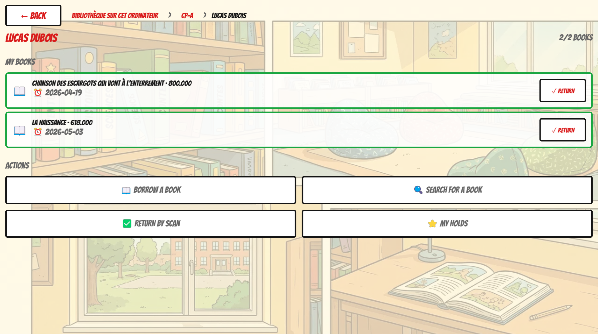

A colorful, Desktop application designed for elementary school students (ages 6-11):

**Features**:
- ✅ Borrow books (barcode scanning)
- ✅ Return books
- ✅ Search catalog with filters
- ✅ Manage holds (reservations)
- ✅ Bilingual (FR/EN)
- 🎨 Bright, kid-friendly design

**Platforms**:
- **Windows** (`.exe` 64-bit)
- **Linux** (`.x86_64` 64-bit)


**Documentation**: [`bcd_kids/README.md`](bcd_kids/README.md)

---

## Features

### Checkout

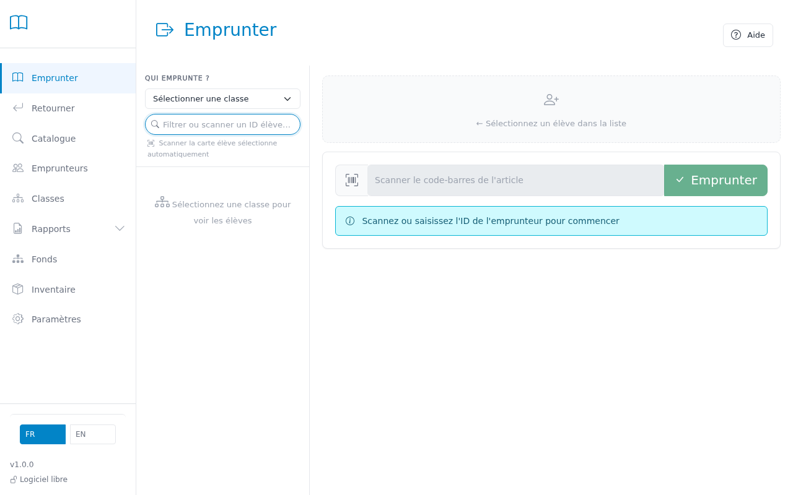

Scan a student's ID card to load their record, then scan each book barcode — books check out instantly, no confirmation needed. The left panel shows the full class roster so you can click on a student instead of scanning.

The borrower card shows their current loans, due dates, and any active holds ready to be fulfilled. Overdue and loan-limit warnings appear automatically.

[→ Detailed help](docs/help/en/checkout.md)

### Return

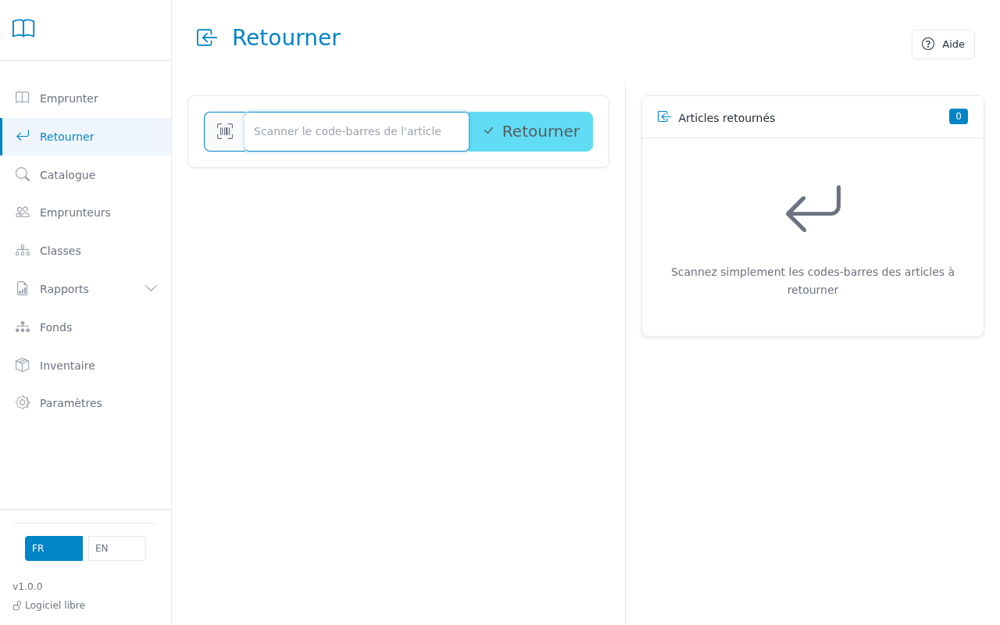

Scan book barcodes one by one — no borrower context required. Each return is immediate. The system shows who had the book and whether it was overdue.

[→ Detailed help](docs/help/en/return.md)

### Renew

Click **Renew All** in the checkout screen or in the borrower detail to extend all eligible books by the configured loan period. Individual renewals are also available from the loans table.

### Holds (Reservations)

Reserve a book for a borrower from the catalog record's **Holds** tab — search the borrower by name or barcode. Active holds appear in the borrower card during checkout with a one-click fulfillment button. Holds can be cancelled at any time.

---

### Catalog

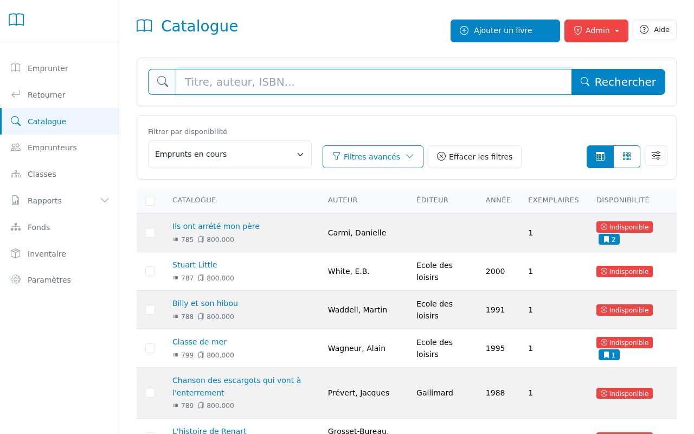

Search by title, author, ISBN, or barcode. Filter by availability (available / on loan / reserved), category, genre, language, or medium type. Each result shows a color-coded status badge and available-copy count.

Click any record to open the detail view with three tabs:
- **Items** — all physical copies, their status, and current borrower
- **Holds** — active reservations with borrower names and positions
- **History** — paginated circulation history with date filters

[→ Detailed help](docs/help/en/catalog.md)

---

### Add Books (Cataloging)

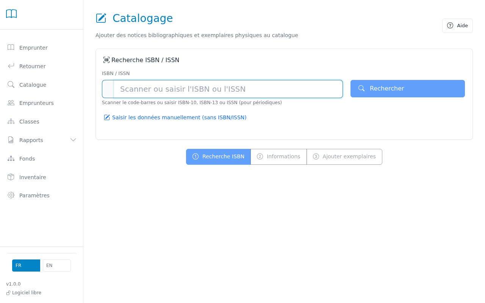

Three-step workflow:

1. **ISBN / ISSN lookup** — scan or type the ISBN (books) or ISSN (magazines / journals); details are fetched automatically from the French National Library (BNF). Skip this step for items without an identifier.
2. **Review metadata** — edit title, author, publisher, category, genre, language, audience, and other fields.
3. **Create items** — scan each physical copy's barcode to register it. Multiple copies can be added in one session.

**Bulk import**: upload a Dublin Core CSV file to import hundreds of books at once. BiblioPuce exports are also supported (automatic format detection).

[→ Detailed help](docs/help/en/cataloging.md)

---

### Borrowers

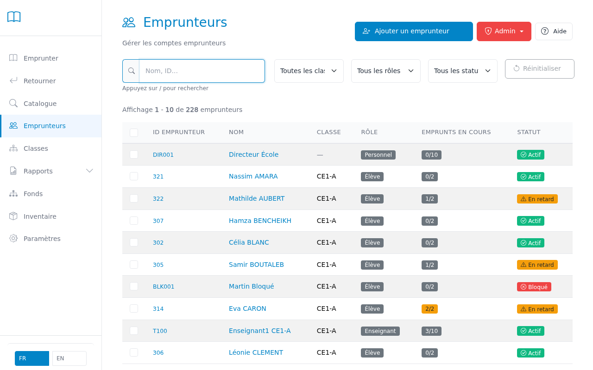

Browse the full borrower list, filtered by class, role, or status. Click any borrower to open their detail view:

- **Loans** tab — current loans with due dates, overdue highlights, per-item return and renew buttons
- **Holds** tab — active reservations with cancel option
- **History** tab — full paginated circulation history with date filters

**Actions available**:
- Block / unblock a borrower (lost book, policy violation, etc.)
- Renew all eligible loans in one click
- Edit borrower details
- Bulk-edit selected borrowers (change class, delete)

**Import / Export**: upload a CSV to create or update borrowers in bulk; export the current list (respects active filters) to CSV for backups or end-of-year transitions.

**Print**: generate print-ready student library cards (10 per A4 page) or reference sheets with barcodes, filtered by class.

**GDPR note**: BCD stores last name, first name, class, and borrower number. Loan records must be deleted within 4 months of return (French CNIL deliberation n° 99-27). Use the bulk-delete action on the borrower list to purge records at end of year.

[→ Detailed help](docs/help/en/borrowers.md)

---

### Classes

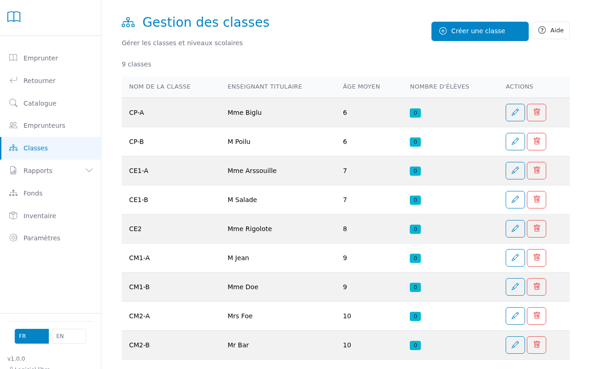

Create, edit, and delete school classes. Each class stores name, grade level, academic year, and homeroom teacher. Classes are used to filter borrowers across all pages and to group overdue reports by class.

[→ Detailed help](docs/help/en/classes.md)

---

### Inventory

The Inventory page supports physical collection checks (récolement) and weeding (désherbage):

- **Scan tab** — scan item barcodes one by one to mark them as physically verified; the scanner retains focus for rapid successive scans
- **File import tab** — import a plain-text file of barcodes (one per line) from a handheld scanner
- **Search tab** — find items using advanced filters (status, condition, never inventoried, low circulation, medium type, audience, genre, language, publication year) and add results to the working table

The **working table** persists in the browser. From it you can bulk-edit items (status, condition, location, medium type, genre, level, audience), bulk-delete items and orphan records, and export an inventory report to CSV.

[→ Detailed help](docs/help/en/inventory.md)

---

### Reports

**Overdue** — all overdue books grouped by class, with borrower names and days overdue. Filter by class. Print-ready.

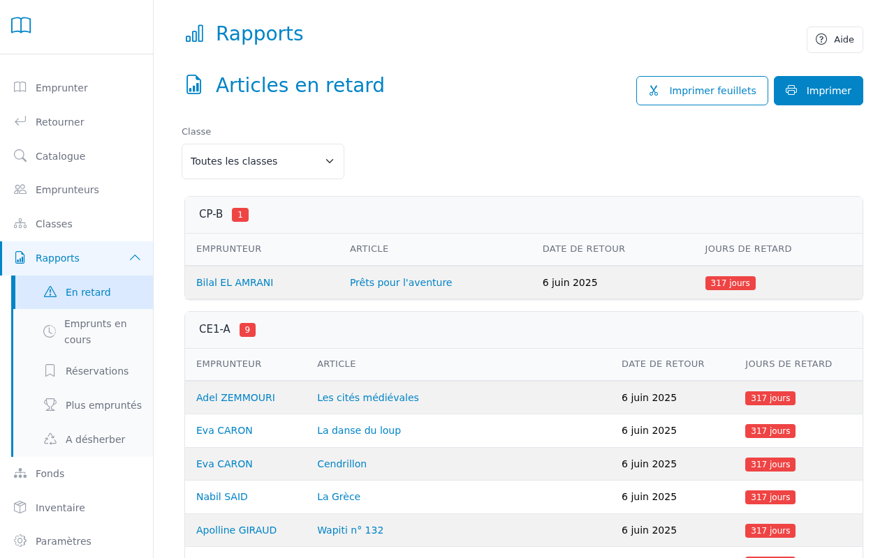

**Most Borrowed** — ranked list of the most circulated titles over any date range. Helps identify what to purchase more of.

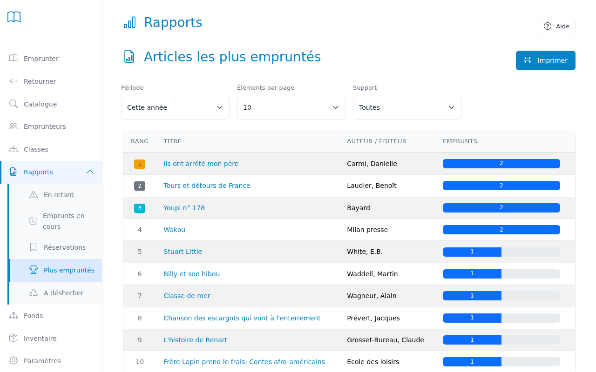

**Active Loans** — full list of all items currently on loan, with borrower, due date, and overdue status. Useful for quick library-wide checks.

**Holds** — list of all active reservations with their status (waiting / ready for pickup / expired).

**CREW Weeding** — systematic collection evaluation using the CREW method. Six evaluation modes:
- **Never Borrowed** — items never checked out since acquisition
- **Low Circulation** — items with ≤2 checkouts in the last 2 years
- **Damaged + Old** — damaged items in collection for 3+ years
- **High Score (≥5)** — priority weeding candidates across all criteria
- **Never Inventoried** — items never physically verified (potentially missing)
- **Duplicate Low Demand** — titles with 3+ copies and low average circulation

Each item receives a CREW score (0-7+) based on age in collection, physical condition, publication year, and circulation history. Color-coded badges (green=keep, orange=review, red=weed) help prioritize decisions. Advanced filters let you narrow results by category, genre, level, audience, and medium type.

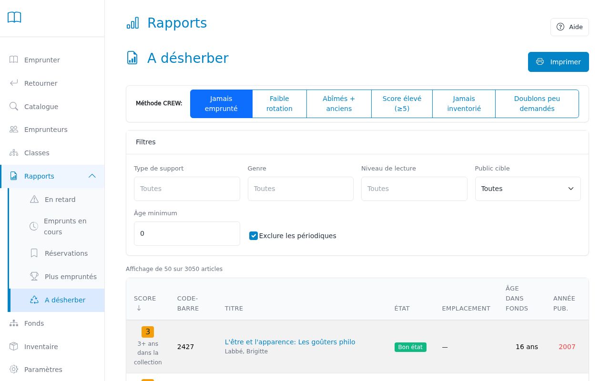

All reports have a browser print button for instant printing.

[→ Detailed help](docs/help/en/reports.md)

---

### Collections (Network Libraries)

The Collections page automatically discovers other BCD libraries running on the same school network (via mDNS — no configuration needed). Each discovered library is shown as a card; click **Open Collection** to browse their catalog in a new tab.

Useful for avoiding duplicate purchases across buildings and for coordinating inter-library loans.

[→ Detailed help](docs/help/en/collections.md)

---

### Settings & Backup

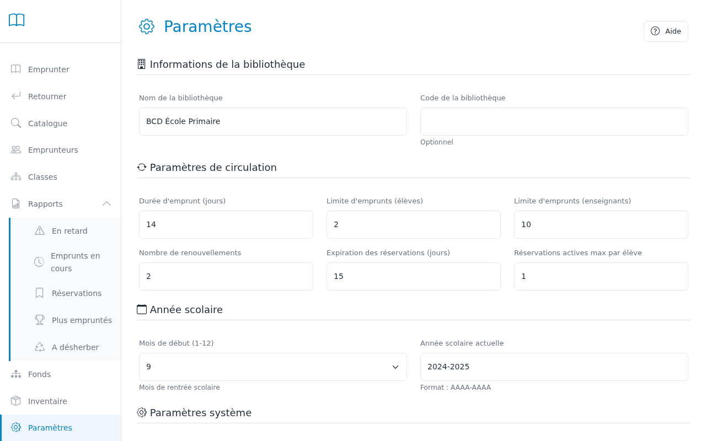

Configure the library system: loan duration, renewal limit, checkout limit (students and teachers), hold expiration, academic year dates, library name, barcode prefixes, language, and date format.

The **Backup** section shows the date of the last backup and lists all existing backups. Create a backup, download one, restore from one, or delete old backups — all from the web interface.

[→ Detailed help](docs/help/en/settings.md)

---

### Print

**Student library cards** (Admin → Print Cards): grid of ID cards (10 per A4 page) with the student's name, class, ID, and barcode. Filter by class before printing.

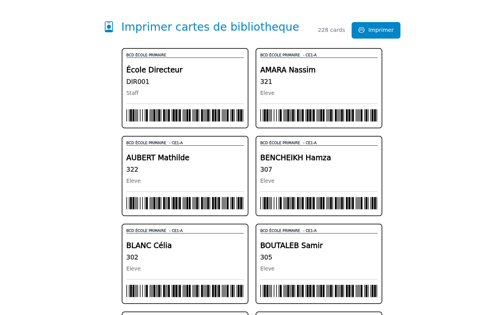

**Item barcode labels** (Admin → Print Labels): Avery-compatible label sheets with item barcodes. Enter a starting ID and count; the system reserves the IDs and renders the labels.

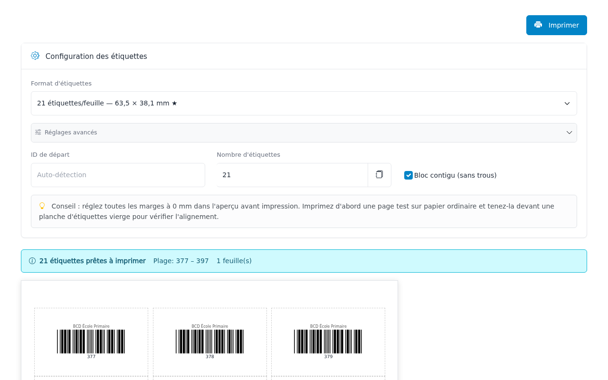

**Borrower reference sheets** (Admin → Print Reference): grouped by class, with each borrower's ID and barcode — useful for teachers to hand out at library visits.

---

## Import & Export

| Data | Import format | Export format |
|------|--------------|---------------|
| Catalog | Dublin Core CSV, BiblioPuce CSV | Dublin Core CSV |
| Borrowers | BCD CSV (borrower_id, first_name, last_name, class, role) | BCD CSV |

Import results show exactly how many records were created, updated, skipped, or failed, with row-level error details.

Export always reflects the current filter — export a single class's borrowers, or the entire catalog.

---

## System Requirements

- Modern browser (Chrome, Firefox, Safari, Edge)
- USB or Bluetooth barcode scanner (optional — barcodes can be typed)
- Internet access only needed for ISBN lookup via BNF (optional)

---

## Backup & Recovery

**Web interface**: Settings → Backup section → Create Backup / Restore.

**CLI** (Python installation):
```bash
bcd-cli admin backup
bcd-cli admin list-backups
bcd-cli admin restore backups/bcd_backup_20260205_143022.db --confirm
```

---

## Language

Switch between French and English using the FR / EN button in the navigation bar. The default is French.

---

## Development

See documentation:
- **CLAUDE.md** — Development guide for AI assistants
- **RELEASE.md** — Release process (version bumping, CI/CD)
- **INSTALL.md** — Installation instructions
- **DEVELOPERS.md** — Developer setup

## License

MIT — see `LICENSE` for details.
