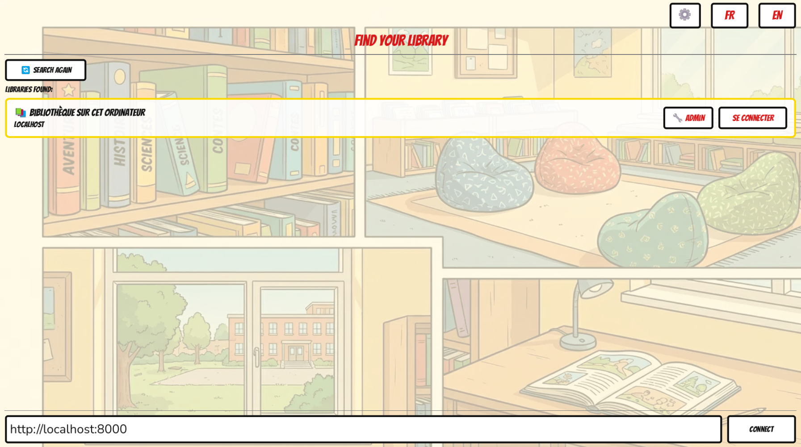
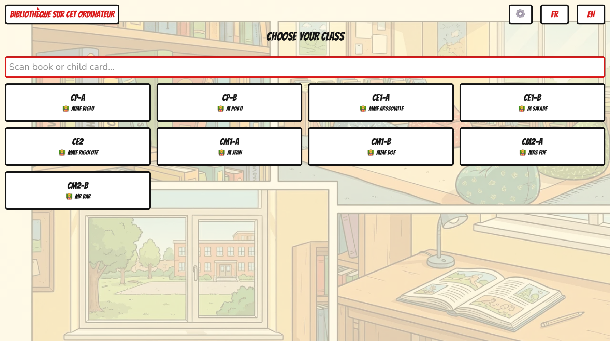
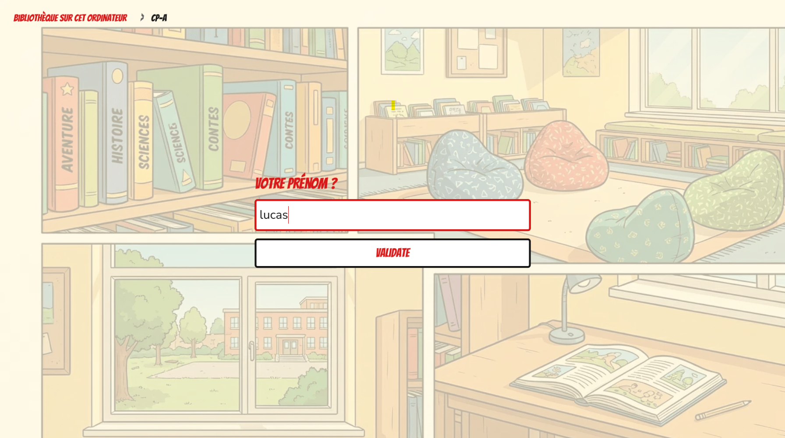
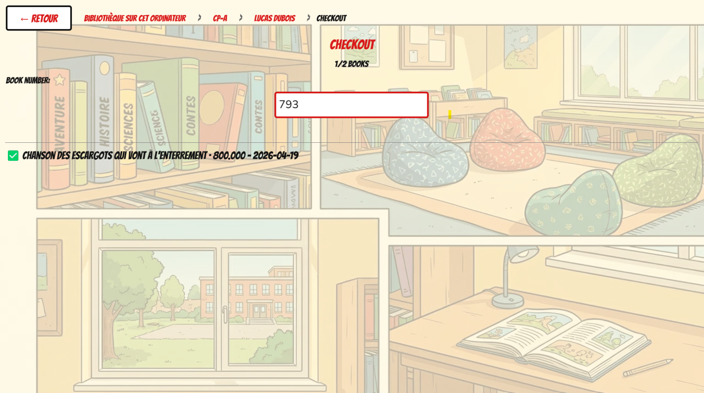
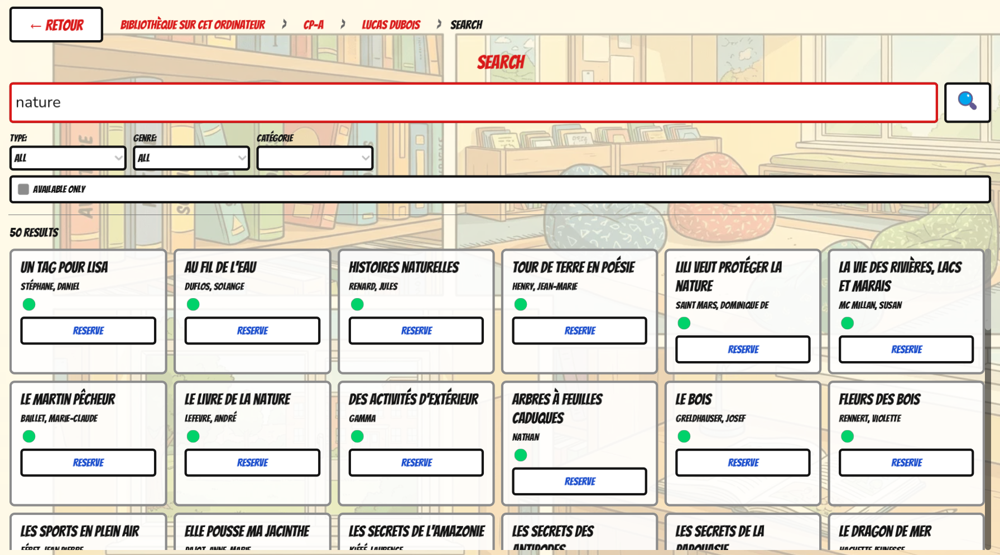
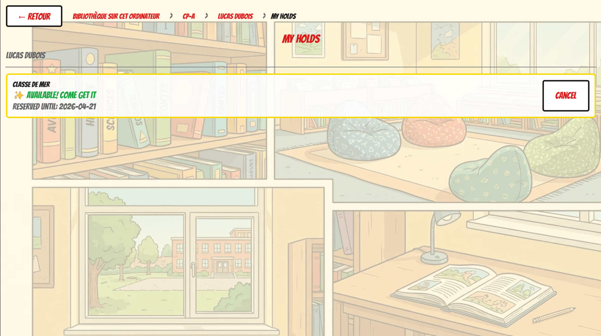

# BCD Kids

This app lets your students (ages 6–11) use the school library on their own:
borrow books, return them, search the catalog, and place reservations.

## How the App Works — Step by Step

### 1. Connecting to the library server

When launched, the app automatically finds the library server on the school
network. If it doesn't, see [Manual connection](#manual-connection) below.

---

### 2. Choosing a class

Students tap their class name.

---

### 3. Entering a first name

Students type their first name — a list of matching names appears to choose
from.

---

### 4. The student's profile

The student sees their current loans and can access all features from here.

---

### 5. Borrowing a book

Scan the barcode on the book — the loan is confirmed immediately.

---

### 6. Searching the catalog

Students can search by title, author, genre or reading level.

---

### 7. Reservations

If a book is already borrowed, students can place a reservation.

## Quick Start

1. Double-click the **BCD Kids** icon on the desktop
2. The app connects automatically to the library server on your school network
3. Students choose their **class**, then their **first name** — and they're ready!

## What Students Can Do

| Action | How |
|---|---|
| 📖 Borrow a book | Scan the barcode on the book |
| 🔄 Return a book | Scan the barcode at the return station |
| 🔍 Search the catalog | Search by title, author, genre or reading level |
| 📌 Reserve a book | Place a reservation if the book is already borrowed |

## Connecting to the Library Server

### Automatic *(recommended)*
When your computer is connected to the school network, the app finds the
library server by itself. Just launch it!

### Manual connection
If the automatic connection fails:
1. On the connection screen, fill in the **"Manual connection"** field
2. Enter the address provided by your IT support
   *(e.g. `http://192.168.1.100:8000`)*
3. Click **Connect**

> 💡 If you don't have the server address, contact your school's IT support.

## Display Settings ⚙️

Click the **⚙️** button on the class selection screen.

**Screen resolution**

| Option | When to use |
|---|---|
| 1280 × 720 | Small or older screen |
| 1920 × 1080 | Large screen |
| **Maximized** *(recommended)* | Adapts automatically |

**Image quality**

| Option | When to use |
|---|---|
| **Low** *(default)* | Older computers — works smoothly |
| High | Recent computers — better image quality |

Settings are saved automatically.

## Troubleshooting

| Problem | Solution |
|---|---|
| App doesn't find the server | Use manual connection (see above) |
| Image looks pixelated | Go to ⚙️ → set quality to **High** |
| App is slow or freezes | Go to ⚙️ → set quality to **Low**, resolution to **1280×720** |
| Barcode scanner not working | Check it is plugged in, then try again |
| Need to switch library server | Use the 🌐 button on the class selection screen |

## Minimum Computer Requirements

| | Minimum |
|---|---|
| **Operating system** | Windows 10 (64-bit) or Linux |
| **RAM** | 4 GB |
| **Free storage** | 100 MB |
| **Network** | Connected to school local network |

The app is designed to run on older school computers.