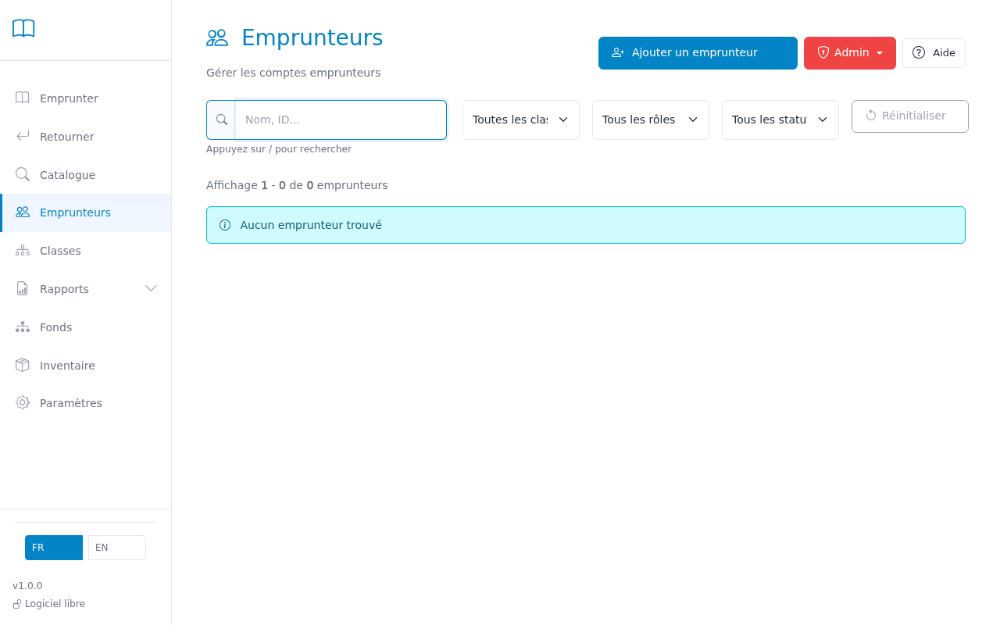
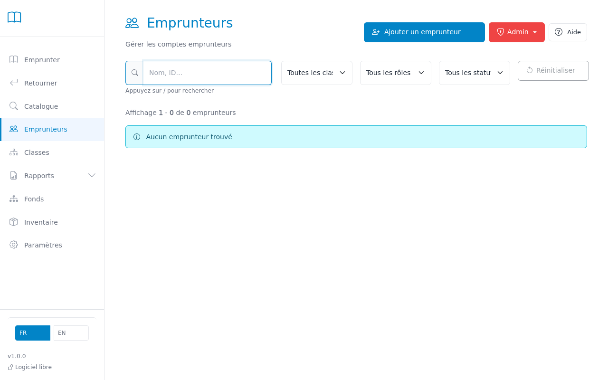
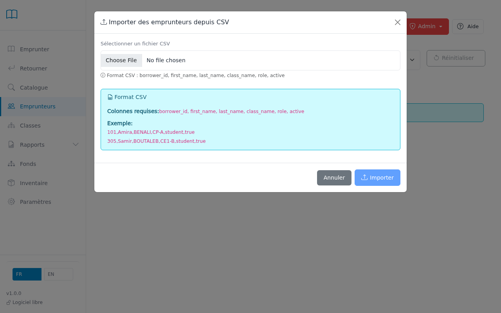

# Managing borrowers

View and manage the records of all library borrowers.

---

## Step 1 — Search for a student

Use the search bar to find a student by their name, first name, or borrower number.
You can also filter by class using the class drop-down menu.

> **Tip:** Click on a column header to sort the list by name, class, or number of loans.

## Step 2 — View a student's record

Click on a student to open their record.
You will find their information, current loans, and loan history.

## Step 3 — Block or unblock a student

In the student's record, click "Block" to prevent them from borrowing new books.
Enter the reason for blocking (lost book, too many overdues, etc.).
To lift the block, click "Unblock".

> **Tip:** A blocked borrower can still return books, but cannot borrow new ones.

## Step 4 — Import students (start of year)

To import a new student list from a CSV file, click the "Admin" menu then "Import".
The file must contain at minimum: last name, first name, class.

---

## Admin menu actions

The **Admin** menu in the top right gives access to administrative actions:

| Action | Description |
|--------|-------------|
| **Add a borrower** | Manually creates a new borrower record (student, teacher, or staff). |
| **Import borrowers** | Imports a list from a CSV file with the format described below. |
| **Export borrowers** | Exports the full borrower list as CSV for review or backup. |
| **Bulk edit** | Moves the selected borrowers to a different class in one operation. |
| **Print reference sheets** | Prints a summary sheet per class with student names and numbers. Useful for teachers in the classroom. |
| **Print library cards** | Generates printable cards with individual barcodes for the selected students. |

### Bulk edit — available operation

The bulk edit for borrowers allows you to **change the class** of all selected students at once.
This is useful at the start of the school year to move an entire class to the next grade.

> **Tip:** First check all students in the relevant class (use the class filter to find them easily), then click "Bulk edit" and select the new class.

### CSV import file format

The import file is a simple spreadsheet you can prepare in **Excel** or **LibreOffice Calc**.

**How to prepare the file in Excel:**

1. Open a new Excel spreadsheet.
2. In **row 1**, type exactly these column headers (mind the underscores `_`):

| Column header | What it contains | Required |
|---------------|-----------------|----------|
| `borrower_id` | Student number (e.g., 12345) | Yes |
| `first_name` | First name | Yes |
| `last_name` | Last name | Yes |
| `class_name` | Class name, exactly as it appears in BCD (e.g., CM1-A) | No |
| `role` | Leave blank for students. Write `teacher` for teachers. | No |
| `active` | Leave blank (account active by default) | No |

3. Fill in the following rows with one student per row.
4. Click **File → Save As**, then choose **CSV UTF-8 (comma delimited)**.

> **Tip:** The class name in the file must match exactly the name shown in BCD (including capitalisation). Check in the Classes page before importing.

> **Tip:** To print cards or use bulk edit, check the boxes on the left of the relevant students first.

---

## GDPR — Personal data protection

### What BCD stores

BCD records the following for each borrower: **last name**, **first name**, **class**, and **borrower number**.
The loan history (title borrowed, loan and return dates) is linked to each record.

### Legal obligations (French CNIL deliberation n° 99-27)

French regulation (which applies within the GDPR framework) requires:

- **Loan data**: must be destroyed within **4 months after the document is returned**.
- **Borrower identity**: must be deleted no later than **1 year after the last loan**.

In a school setting, the CNIL accepts that this deletion is done **at the end of the school year** rather than on a rolling basis.

### How BCD handles compliance

**BCD permanently deletes** borrower data.

> When you delete a borrower, **all their data is immediately and permanently erased**: their personal record, any current loans, and their full loan history. This cannot be undone.

This deletion ensures GDPR compliance without any complex procedure.

### End-of-year procedure

**At the end of each school year**, delete the records of students who are leaving:

1. **Departing CM2 students**: filter the list by CM2 class, check all students, click "Delete selected" in the Admin menu.
2. **Students inactive for more than one year**: if students from other classes have had no loans since the previous school year, delete their records too.

> **Important:** Before deleting students, check that they have no **active loans** (unreturned books). If so, record the return (or mark the item as lost) first, then delete the record.

> **Tip:** The typical start-of-year workflow is: **delete CM2 students** → **import the new class list** → **promote classes** (CE1 becomes CE2, etc.) using bulk edit.

---

## Common Issues

| Problem | Solution |
|---------|----------|
| Student does not appear in the list | Check active filters — click "Reset" to show all students. |
| Cannot block a student | Only an administrator can block a borrower. Check your access rights. |
| CSV import fails | Make sure the file was saved as **CSV UTF-8** in Excel (File → Save As → CSV UTF-8). Column headers must be exactly as listed above. |
