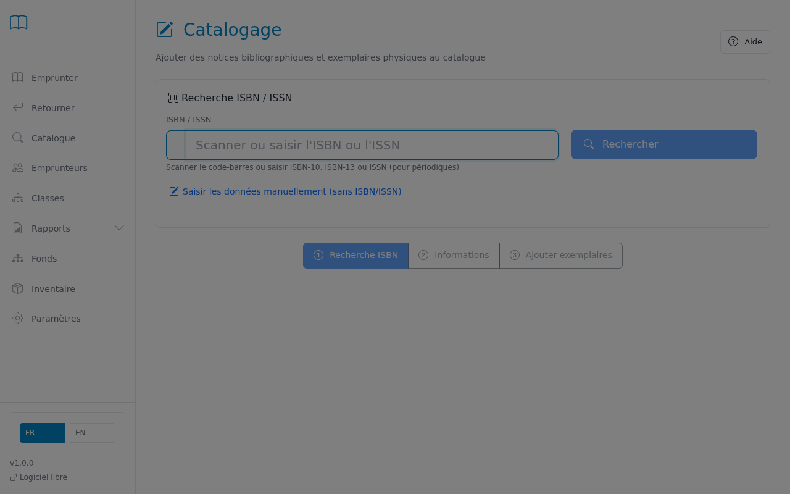
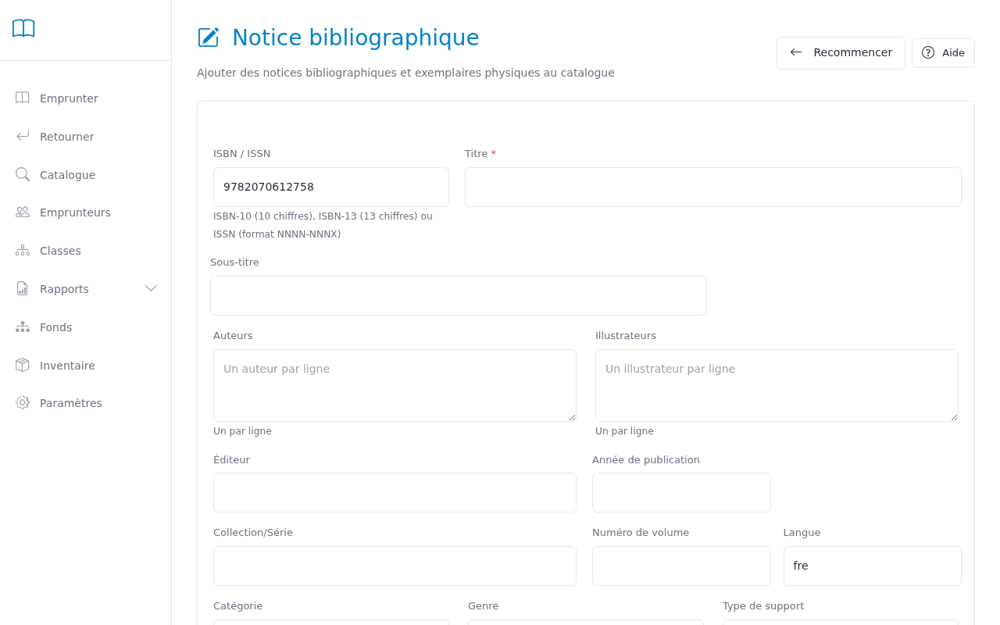
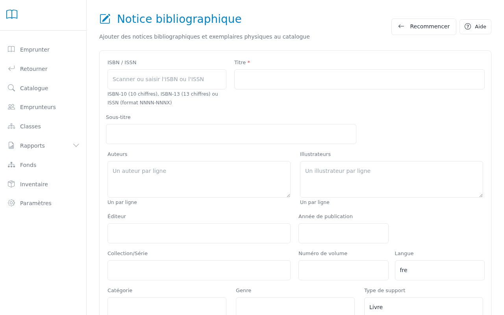
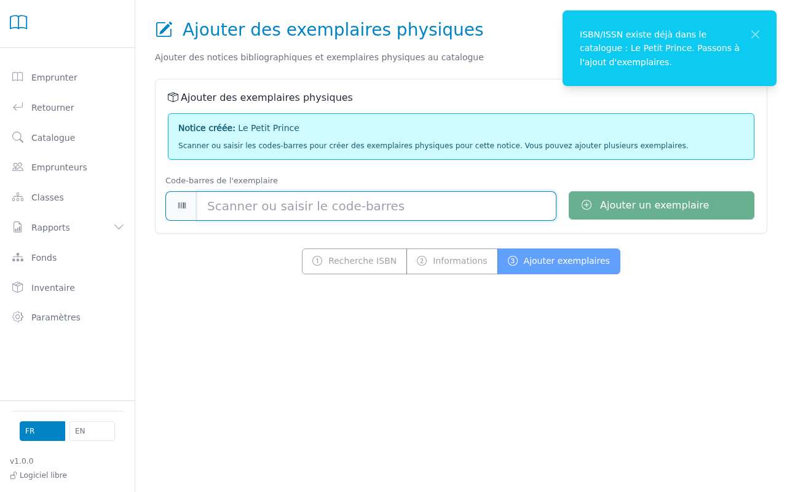

# Adding books

Use this page to add new books to the library catalog.

---

## Step 1 — Enter the ISBN number

Type or scan the ISBN barcode on the book (the 13-digit number on the back cover).
The system automatically searches for bibliographic data from the BNF (French National Library).

> **Tip:** The ISBN barcode is usually printed on the back cover, below the barcode lines.

## Step 2 — Verify the information

The retrieved information (title, author, publisher, year) appears automatically.
Check and correct if needed before confirming.

> **Tip:** If the ISBN is not recognized by the BNF, you can fill in the form manually by clicking "Manual entry".

## Step 3 — Add a book without ISBN

For older books without an ISBN barcode, click "Manual entry" and fill in the form.
Only the title is required.

## Step 4 — Scan the book barcode

After confirming the record, scan the inventory barcode sticker inside the book.
This barcode is the unique identifier for the physical copy.

---

## Bibliographic record fields

When creating or editing a record, here is the role of each field:

### Basic information

| Field | Role | Required |
|-------|------|----------|
| **ISBN or ISSN** | For a book: 13-digit ISBN (on the back cover). For a magazine or journal: ISSN in the format `NNNN-NNNX` (e.g., `0153-5021`). The system automatically detects the format and queries the appropriate source. | No |
| **Title** | Main title of the book as it appears on the cover. | **Yes** |
| **Subtitle** | Subtitle if present. | No |
| **Author(s)** | One author per line. Recommended format: Last name, First name. | No |
| **Illustrator(s)** | One illustrator per line (picture books, comics). | No |

### Publication

| Field | Role | Required |
|-------|------|----------|
| **Publisher** | Publishing house (e.g., Gallimard, Flammarion). | No |
| **Publication year** | Year of publication (e.g., 2023). | No |
| **Collection/Series** | Name of the collection or series (e.g., Folio Junior, Harry Potter). | No |
| **Volume number** | Position in the series (e.g., Vol. 3). | No |
| **Language** | ISO 639-1 language code (e.g., `fr`, `en`, `es`, `de`, `ar`). Used for filtering in the catalog and inventory. Auto-filled via BNF lookup. | No |

### Classification and organization

| Field | Role | Required |
|-------|------|----------|
| **Medium type** | Physical format of the document (e.g., Book, Comic, Magazine, CD, DVD). | No |
| **Genre** | Literary sub-category (e.g., Adventure, Mystery, Fantasy). | No |
| **Target audience** | Child (up to 8 years) / Youth (8–15 years) / Adult. Refines searches and statistics. | No |
| **Reading level** | Recommended school level (e.g., Year 1, Year 3, Year 5). Free text. | No |

### Content description

| Field | Role | Required |
|-------|------|----------|
| **Keywords** | Additional search terms separated by commas. Improve discoverability in the catalog. | No |
| **Description** | Summary or back-cover text. Displayed in the detail record. | No |
| **Page count** | Number of pages (informational). | No |
| **Has illustrations** | Check if the book contains illustrations (picture books, illustrated non-fiction). | No |

> **Tip:** Only the title is required. The more fields are filled in, the better the search results in the catalog.

---

## Cataloging a class set (multiple copies)

For a class reading activity, you need several copies of the same book. In BCD4, one bibliographic record can have as many physical copies as needed.

**How to proceed:**

1. Catalog the book once normally (ISBN → BNF → scan first barcode).
2. To add more copies: open the book's record in the catalog, then click **"Add a copy"**.
3. Scan each additional copy's barcode one by one.

> **Tip:** Use a consecutive series of barcode labels (e.g., `00120`, `00121`, `00122`…) to make the set easy to manage.

---

## Copy fields

Each copy is a separate record (one physical book). These fields are editable from the catalog detail record → pencil icon on the copy.

| Field | Role |
|-------|------|
| **Barcode** | Unique identifier for the copy (barcode label on the book). Free text up to 20 characters: numeric (`00123`), alphanumeric (`BCD001234`), or any other format. |
| **Issue number** | Periodicals only: issue number (e.g., `274`) or period label (e.g., `April 2026`, `Summer special 2025`). Displayed in the copy list and in circulation feedback. Required when adding a copy to a `Périodique` record. |
| **Call number** | Shelf classification code (e.g., `F DUM`, `503`). Copied automatically from the bibliographic record when the copy is created. |
| **Location** | Zone or shelf where the copy is kept (e.g., `Fiction`, `Non-fiction`, `Reading corner`, `Class CM2`). Free text. Used in inventory filters. |
| **Condition** | Good / Damaged. |
| **Loanable** | Uncheck to remove a copy from the loan circuit without deleting it (e.g., a reference-only copy). |
| **Status** | Available / On loan / Lost / Withdrawn. Managed automatically by the system during checkouts and returns. |

> **Tip:** If you have two copies of the same book shelved in different locations (one in the main stacks, one in a class reading set), give them distinct locations. The Inventory → Location filter lets you find each copy precisely.

---

## Migrating from a previous system

If your library already had barcode labels from a previous system, **there is no need to re-sticker the books**.

### Keeping existing barcodes

The inventory barcode (`item_id`) is a free-text field: BCD4 accepts any format — numeric (`00123`), prefixed (`BCD001234`), or mixed alphanumeric. When cataloging a copy that already has a label, simply scan the existing sticker — BCD4 stores the value as-is.

**BiblioPuce import:** when importing a BiblioPuce CSV file (Admin → Import catalog → BiblioPuce format), the old inventory codes are carried over automatically. No manual re-entry is needed.

### Continuing an existing number sequence

If part of the collection already has numeric barcodes and you want to continue the same sequence for new acquisitions:

1. **Admin → Print labels**
2. In the **Start from** field, enter the number after the last one already in use (e.g., if the last barcode in service is `00847`, enter `848`)
3. The system generates the next free identifiers from that point, skipping any already assigned

> **Tip:** BCD4's label generator produces numeric identifiers. If you need a fixed prefix on your labels (see section below), configure it in Settings → Barcodes before printing.

### Barcode prefix convention (BiblioPuce compatible)

BiblioPuce and BCD4 use the same prefix convention to automatically distinguish book barcodes from student card barcodes at the circulation desk:

| Type | Default prefix | Example scanned |
|------|----------------|-----------------|
| Copy (book) | `.` (period) | `.00785` |
| Borrower (student) | `%` (percent) | `%10234` |

When the scanner reads a barcode, BCD4 detects the prefix and immediately knows whether it is a book or a student card — without the teacher needing to switch fields manually.

**Migrating from BiblioPuce:** BiblioPuce already uses this convention. Existing labels are fully compatible with no changes.

**If you do not use a prefix** (scanner returns the raw number, or your previous system used a different format): leave the prefix fields empty in Settings. The prefix is configurable — see Settings → Barcodes.

> **Tip:** The prefix is printed on labels generated by BCD4 (Admin → Print labels). If you change the prefix in Settings after labels have already been printed, old labels will no longer be recognized correctly.

---

## Cataloging a magazine or periodical

In BCD4, **one periodical title = one catalog record**, and **each physical issue received = one copy** attached to that record. The **Issue number** field on the copy identifies the issue (e.g., `274`, `April 2026`, `Summer special 2025`).

### Creating a record for a new periodical title

**Via the kiosk EAN-13 barcode (recommended):**

1. On the Cataloging page, type or scan the EAN-13 barcode printed on the magazine cover (the 13-digit code starting with `977`, e.g., `9771163770025` for Wakou).
2. The system automatically detects the `977` prefix and extracts the ISSN.
3. It queries the **SUDOC** (French academic union catalog) to retrieve the title, publisher, and description.
4. Verify the information and confirm the record. **Medium type** is automatically set to `Périodique`.
5. Scan the copy's inventory barcode, then fill in the **Issue number** (e.g., `274`).

**Via manual ISSN entry:**

1. In the **ISBN or ISSN** field, type the ISSN in the format `NNNN-NNNX` (e.g., `1163-7706` for *Wakou*). The ISSN is printed on the cover or back of the magazine.
2. The system recognizes the ISSN format and queries SUDOC.
3. Continue from step 3 above.

**If the periodical is not found in SUDOC:**
use manual entry — type the title, fill in the ISSN if available, and choose `Périodique` as the medium type.

### Recording a new issue (daily workflow)

When a new issue arrives:

1. Open the periodical's catalog record (e.g., "Wakou").
2. Click **"Add a copy"**.
3. Enter the **Issue number** (e.g., `274` or `April 2026`) — required for periodicals.
4. Scan the physical issue's inventory barcode.
5. The copy is immediately available for loan.

> **Tip:** The issue number appears in the record's copy list (column "Issue number") and in circulation feedback (e.g., "Wakou · n° 274"). Use short numeric values (`274`) rather than long labels for optimal display.

---

## Common Issues

| Problem | Solution |
|---------|----------|
| ISBN not found in BNF | Use manual entry. Some older or foreign editions are not in the BNF database. |
| ISSN not found in SUDOC | Use manual entry. Enter the title and ISSN manually, then choose `Périodique` as the medium type. |
| Inventory barcode already in use | Each copy must have a unique barcode. Stick a new barcode label on this book. |
| Retrieved information is incorrect | Manually correct the fields in the form before confirming. |
