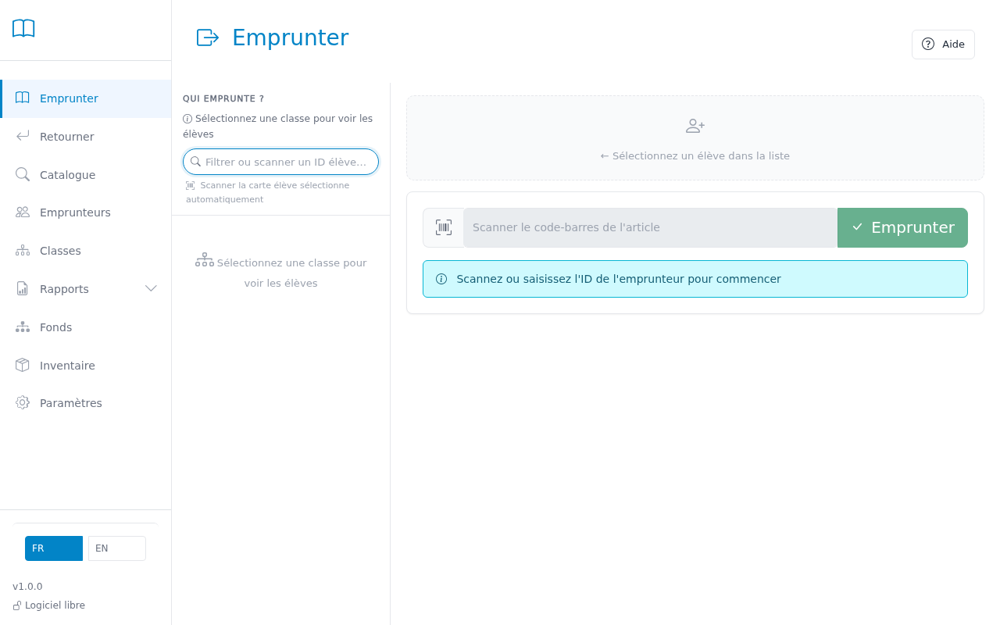
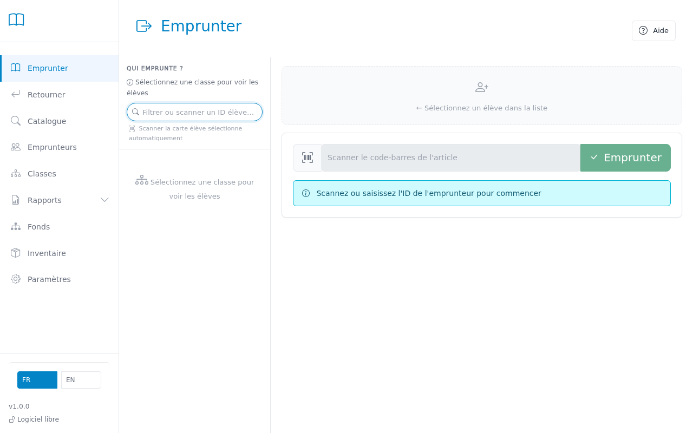

# Checking out books

Use this page to lend one or more books to a student or teacher.

---

## Step 1 — Enter the borrower number

Type or scan the student's number in the "Borrower Number" field.
The student's record appears automatically with their current loans.

> **Tip:** You can use a barcode scanner to scan the student's library card directly.

## Step 2 — Check the borrower's record

Verify the name, class, and number of books already borrowed.
A red badge indicates the student has reached the limit or has overdue items.

> **Tip:** If the student has overdue books, they appear highlighted in red in their loan list.

## Step 3 — Scan the books

Scan the barcode on each book to be borrowed.
Each book added appears in the list at the top of the screen.

## Step 4 — Confirm the checkout

The checkout is recorded automatically as soon as the barcode is scanned.
The due date is calculated automatically based on the library settings.

> **Tip:** To switch to a different student, click their name in the class list on the left
> or type a new borrower number.

---

## Common Issues

| Problem | Solution |
|---------|----------|
| "Loan limit reached" | The student already has the maximum number of books allowed. They must return one before borrowing a new one. |
| "Book already on loan" | This book is currently with another student. Offer a different copy or note a reservation. |
| Borrower number not recognized | Check the format is correct (e.g., 12345) or search for the student in the borrowers list. |
| Book barcode not working | Type the inventory number manually in the scan field. |
