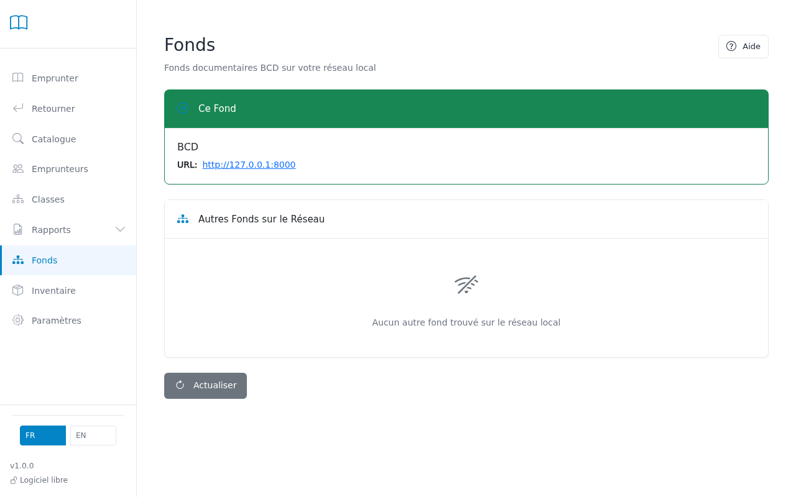

# Collections

Find and visit other school library catalogs on your network.

---

## What is this page for?

If your school has multiple libraries (for example, one in the elementary building and one in the middle school), this page lets you see and visit their catalogs.

BCD automatically finds other school libraries on the same network — no setup needed.

---

## Step 1 — See your library

The green card at the top shows your own library:

- **Library name**: The name you gave your library in Settings
- **Web address**: Where teachers and students can find your library online

---

## Step 2 — Find other libraries

The "Other Collections on Network" section shows libraries BCD found on your school network.

**You might see:**
- **Loading...** — BCD is searching for other libraries
- **No other collections found** — You are the only BCD library on the network right now
- **Library cards** — BCD found one or more other school libraries

---

## Step 3 — Visit another library

To see what books another library has:

1. Click **"Open Collection"** on their library card
2. Their catalog opens in a new tab
3. Search and browse just like you do in your own catalog

> **Note:** You can only view their catalog. You cannot check out books or change their settings.

---

## Refresh the search

Click the **"Refresh"** button to search the network again.

**When to refresh:**
- A colleague just started their library software
- You want to check if a library is still available
- You moved to a different network

---

## Why use this?

**Check what other schools have:**
- See if the middle school has a book your students need
- Avoid buying duplicates if another building already has it
- Coordinate book purchases across multiple libraries

**Plan inter-library loans:**
- Find which library has a specific book
- Request to borrow from another building

---

## Common issues

| Problem | Solution |
|---------|----------|
| No other libraries show up | The other library software might not be running, or you are on different networks. Ask your school IT person to check. |
| A library shows up but won't open | That library might have been turned off. Click "Refresh" to update the list. |
| I see libraries I don't recognize | If your school network is large, you might see libraries from other buildings or schools. Check the library name to identify them. |

---

*For technical problems finding other libraries, ask your school IT support.*
