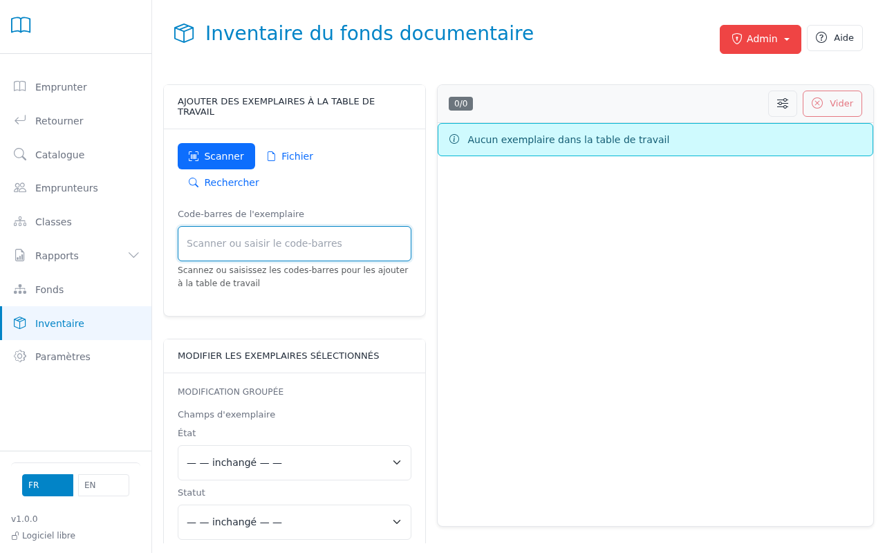

# Collection Inventory

The Collection Inventory page helps you conduct physical inventory checks (récolement) and weeding (désherbage) of your library collection.

## Overview

This tool allows you to:
- Track which items have been physically verified
- Identify items for weeding based on circulation, age, and condition
- Bulk edit item and bibliographic record fields
- Delete items and clean up orphan records
- Export inventory reports to CSV

## Getting Started

### Scan Tab

Scan item barcodes one by one to mark them as inventoried:

1. Place your cursor in the barcode input field (it auto-focuses)
2. Scan an item barcode or type the item ID
3. Press Enter
4. The item appears in the working table with today's inventory date



**Tips:**
- Items already in the table will move to the top (highlighted)
- Unknown barcodes show an error notification
- The scanner keeps focus for quick successive scans

### File Import Tab

Import a list of item IDs from a text file (useful with handheld scanners):

1. Click "Choose File" and select a `.txt` file
2. The file should contain one barcode per line
3. The system shows valid/unknown ID counts
4. Click "Import" to add valid items to the working table

**File format:**
```
0785
0784
0312
# Comments start with #
```

### Search Tab

Find items using advanced filters to identify candidates for weeding:


**Text Search:** Title, author, ISBN, or call number

**Item Filters:**
- Status (available, on loan, withdrawn, etc.)
- Condition (good, damaged)
- Location

**Inventory Filters:**
- Never inventoried
- Not inventoried since [date]

**Rotation Filter (CREW Method):**
- Find items with fewer than X loans since a specific date
- Example: "fewer than 2 loans since 2022-04-01" identifies low-circulation items

**Record Filters:**
- Medium type, target audience
- Genre, reading level, language
- Publication year range

> **Tip:** For text fields (location, medium type, genre, level, language), type `__none__` to filter items where that field is not set.

**Results:**
- Capped at 200 items (refine filters if needed)
- Select items and click "Add to Working Table"

## Working Table

The working table persists in your browser and survives page refreshes.

**Actions:**
- Select/deselect items using checkboxes
- Shift+click to select a range
- Clear selected or clear all

## Bulk Operations

### Bulk Edit

Modify multiple items and their records at once:

1. Select items in the working table
2. Click the admin menu (⋮) → "Bulk Edit"
3. Change item fields (status, condition, loanable, location)
4. Change record fields (medium type, genre, level, target audience)
5. Leave fields as "— unchanged —" to keep existing values
6. Select "— Clear —" in a field to erase its current value
7. Confirm the operation

**Notes:**
- Items on loan cannot have their status changed (safety measure)
- Record changes affect all copies of the same title
- The confirmation shows how many other copies will be affected

### Bulk Delete

Permanently remove items from the system:

1. Select items in the working table
2. Click the admin menu (⋮) → "Delete Items"
3. Review the confirmation (shows exclusions)
4. Confirm deletion

**Safety measures:**
- Items on loan are automatically excluded
- Active holds are cancelled
- Orphan records (titles with no remaining items) are flagged

### Export to CSV

1. Click the admin menu (⋮) → "Export CSV"
2. A file `inventory_YYYY-MM-DD.csv` downloads with 9 columns:
   - Barcode, Title, Author, Call Number, Location
   - Status, Condition, Last Loan Date, Last Inventory Date

## Admin Functions

### Delete Orphan Records

Clean up bibliographic records that have no remaining items:

1. Click the admin menu (⋮) → "Delete Records Without Items"
2. Review the list of orphan records
3. Confirm deletion

**Use case:** After bulk deleting items during weeding

## Best Practices

**Annual Inventory (Récolement):**

The goal is to detect items missing from the shelves: lost, misplaced, or unreturned loans.

**Step 1 — Scan a section**
1. Note your session start date and time (e.g. April 14, 2026)
2. Scan tab → scan every item on the chosen shelf section
3. Repeat for each section as needed

**Step 2 — Find absent items**

Once scanning is done, switch to the **Search** tab and combine these filters:
- **Location** = the section you just scanned (e.g. "Non-fiction", "Fiction")
- **Not inventoried since** = your session start date (e.g. 2026-04-14)
- **Status** = Available (to exclude items legitimately on loan)

The results are items **expected on that shelf but not scanned**: candidates to investigate (misplaced or lost).

**Step 3 — Handle absent items**
- Physically check whether these items are simply shelved elsewhere
- Items that cannot be found → add to working table → Bulk Delete
- Export the list for administrative records

**Weeding (Désherbage):**

Weed section by section, not all at once. Handle non-fiction and fiction separately — the criteria differ.

*Non-fiction (reference books, science, geography…)*
- Two combined criteria: **age** of the item + **low circulation**
- Example search: Publication year ≤ 2018 **and** fewer than 2 loans since 2022-09-01
- Scientific, geographical and practical information becomes outdated quickly

*Fiction (novels, picture books, comics, manga…)*
- Main criteria: **physical condition** and **demand** (do not remove a well-loved book just because it is old)
- Example search: Condition = Damaged **or** fewer than 1 loan since 2021-09-01
- Keep classics and titles still requested, regardless of age

**Weeding workflow:**
1. Use Search to identify candidates (rotation + publication year filters)
2. Add candidates to the working table
3. Review the list visually (condition, last loan date, last inventory date)
4. **Before deleting**: Export to CSV (⋮ → Export CSV) — this list serves as your administrative record
5. Bulk delete the selected items
6. If orphan records appear, use ⋮ → "Delete Records Without Items"

> **Tip:** Always do a physical check before deleting. A "missing" item may simply be on loan, shelved in the wrong place, or being consulted. Finish scanning an entire section before taking any action.

**CREW Method:**
- C: **C**ontinuous evaluation (don't wait for the collection to deteriorate)
- R: **R**eview circulation and physical condition
- E: **E**valuate using MUSTIE criteria
- W: **W**eed items that no longer serve the collection

**MUSTIE criteria:**
- **M** : Misleading — information is factually wrong or outdated (e.g. atlas with obsolete borders)
- **U** : Ugly — physical condition too poor to circulate
- **S** : Superseded — a newer, better edition is available
- **T** : Trivial — shallow content of little value
- **I** : Irrelevant — no longer matches the audience or curriculum
- **E** : Elsewhere — the same content is easily available elsewhere

## Keyboard Shortcuts

- **Tab navigation** between filter fields
- **Enter** in barcode input → scan
- **Shift+Click** in table → range selection

## Troubleshooting

**"Item not found" when scanning:**
- Verify the barcode is correct
- Check if the item exists in the catalog

**Search returns "Showing 200 of 500 results":**
- Refine your filters to get a smaller result set
- The 200 limit prevents browser slowdown

**Archive warning when using rotation filter:**
- Historical loan records older than the archive cutoff may be incomplete
- Your rotation filter date is before the oldest available transaction

---

*For questions or issues, contact your system administrator.*
