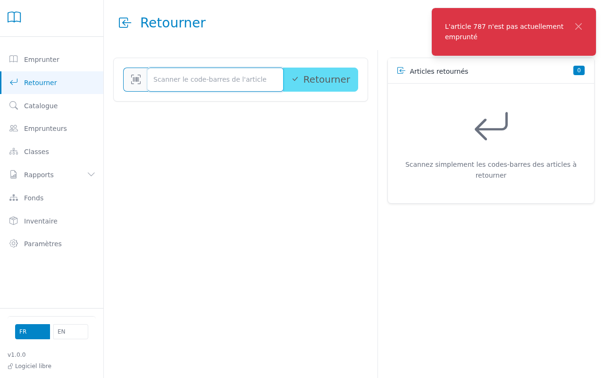

# Returning books

This page lets you record the return of one or more borrowed books.

---

## Step 1 — Scan the book barcode

Scan the barcode on the book to be returned directly.
The return is recorded immediately, without needing to identify the borrower first.

> **Tip:** You can scan books one after another without any action between each scan.

## Step 2 — Check the return summary

Each returned book appears in the list on the right side of the screen.
The list shows the title, inventory number, and return time.

> **Tip:** If a book was overdue, a red "Overdue" badge appears in the list.
> The borrower is not automatically blocked — that is your decision.

> **Tip:** To check a student's full situation (current loans, overdues), go to the **Borrowers** page and search by name or ID.

---

## Common Issues

| Problem | Solution |
|---------|----------|
| Barcode not recognized | Check that the item prefix is correctly configured in Settings, or type the inventory number manually. |
| "Item not on loan" | This book is not currently checked out. Verify the inventory number. |
| Overdue not displayed | Overdue status only shows if the due date has passed. Check the system date. |
