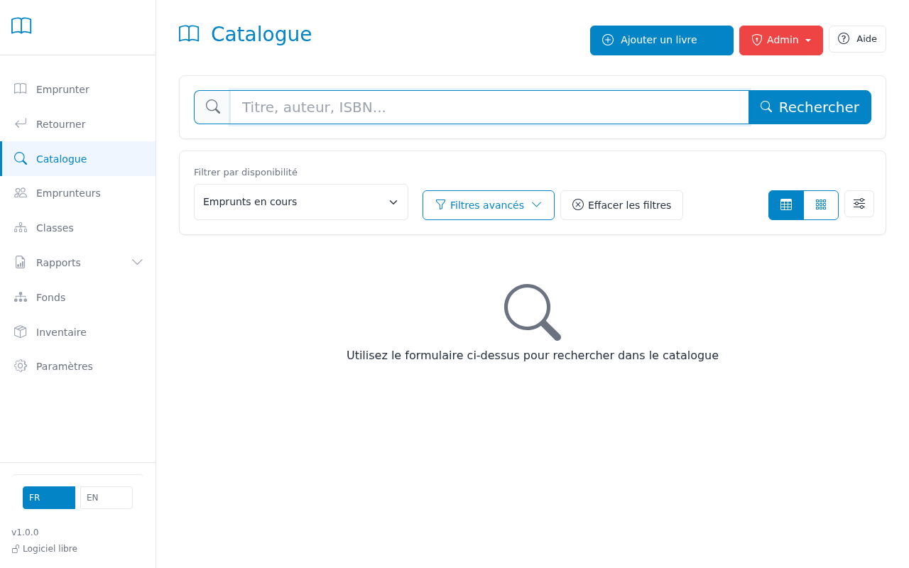
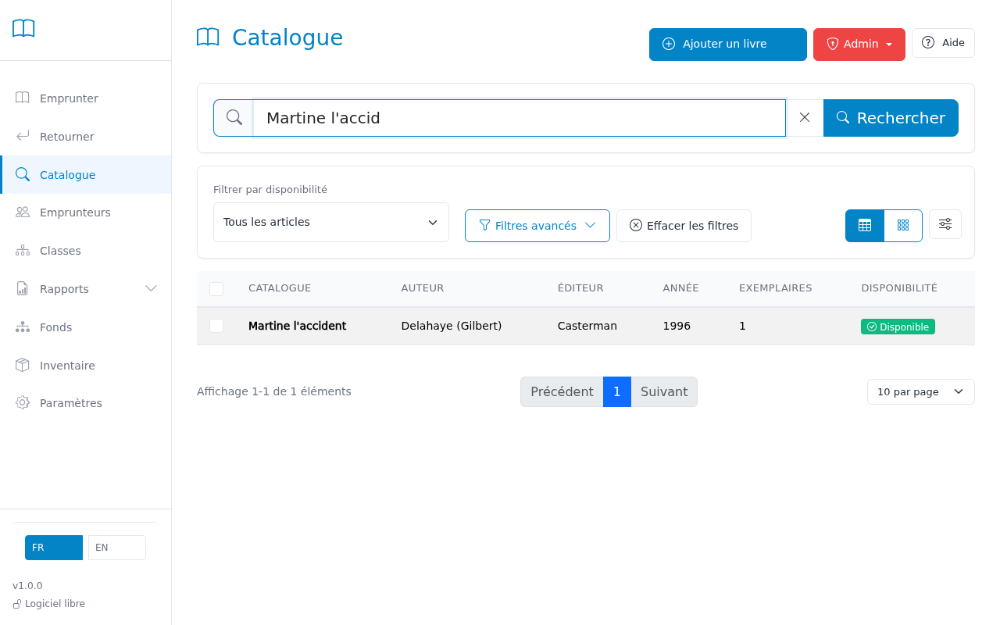
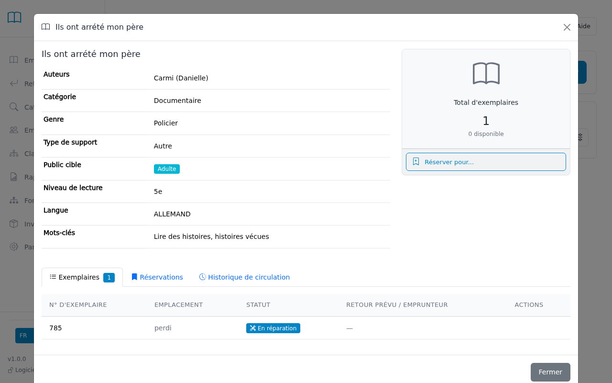

# Consulter le catalogue

Cette page te permet de rechercher et consulter tous les livres disponibles dans la bibliothèque.

---

## Étape 1 — Rechercher un livre

Tape un titre, un auteur ou un numéro ISBN dans la barre de recherche.
Les résultats s'affichent immédiatement pendant la saisie.

> **Conseil :** Tu peux laisser la barre de recherche vide pour afficher tous les livres du catalogue.

## Étape 2 — Lire la disponibilité

Chaque livre indique le nombre d'exemplaires disponibles et le nombre total.
Un badge vert signifie qu'au moins un exemplaire est disponible. Un badge rouge signifie que tous les exemplaires sont empruntés.

## Étape 3 — Consulter la fiche détail

Clique sur un titre pour ouvrir la fiche complète du livre.
Tu y trouves tous les exemplaires, leur statut, et l'historique des emprunts récents.

> **Conseil :** Dans la fiche détail, tu peux ajouter un nouvel exemplaire en cliquant sur « Ajouter un exemplaire ».

---

## Actions du menu Admin

Le menu **Admin** en haut à droite donne accès aux actions d'administration :

| Action | Description |
|--------|-------------|
| **Ajouter un livre** | Accède directement à la page de catalogage pour créer une nouvelle notice. |
| **Importer catalogue** | Importe une liste de livres depuis un fichier CSV préparé avec Excel ou exporté depuis BiblioPuce. |
| **Exporter catalogue** | Exporte tout le catalogue en CSV pour sauvegarde ou migration vers un autre logiciel. |
| **Édition groupée** | Modifie en lot un ou plusieurs champs des notices sélectionnées. |
| **Étiquettes** | Génère et imprime des étiquettes de codes-barres à coller sur les livres avant catalogage. |

### Édition groupée — champs disponibles

Coche les notices à modifier, puis clique sur **Édition groupée**. Tu peux mettre à jour :

| Champ | Description |
|-------|-------------|
| **Type de support** | Format physique (ex : Livre, BD, Revue). Valeurs configurées dans les paramètres. |
| **Genre** | Sous-catégorie littéraire (ex : Fantastique, Policier). Valeurs configurées dans les paramètres. |
| **Public cible** | Enfant / Jeune / Adulte. |
| **Langue** | Langue du livre (ex : Français, Anglais). Valeurs configurées dans les paramètres. |

> **Conseil :** Laisse un champ vide pour ne pas le modifier — seuls les champs remplis sont mis à jour.

### Format du fichier CSV d'import

Le fichier d'import est un tableau que tu prépares avec **Excel** ou **LibreOffice Calc**, ou que tu exportes directement depuis **BiblioPuce**.

**Si tu utilises BiblioPuce :** exporte ta bibliothèque normalement, puis sélectionne le format « BiblioPuce » dans la fenêtre d'import de BCD. Aucune autre manipulation n'est nécessaire.

**Si tu prépares le fichier manuellement avec Excel :**

1. Ouvre un nouveau classeur Excel.
2. En **ligne 1**, tape exactement ces en-têtes (attention au point `.` dans chaque nom) :

| Colonne à saisir | Ce que ça contient | Obligatoire |
|------------------|--------------------|-------------|
| `dc.title` | Titre du livre | Oui |
| `dc.identifier` | Numéro ISBN (13 chiffres au dos du livre) | Recommandé |
| `dc.creator` | Auteur(s). Si plusieurs, séparés par un `\|` | Non |
| `dc.publisher` | Éditeur (ex : Gallimard) | Non |
| `dc.date` | Année de publication (ex : 2023) | Non |
| `dc.language` | Langue (écrire `fr` pour français, `en` pour anglais) | Non |
| `dc.subject` | Mots-clés, séparés par un `\|` | Non |
| `dc.description` | Résumé du livre | Non |
| `dc.type` | Type de document (ex : Livre, BD, Revue) | Non |
| `dc.format` | Format physique (ex : broché, relié) | Non |

3. Remplis les lignes suivantes avec un livre par ligne.
4. Clique sur **Fichier → Enregistrer sous**, puis choisis **CSV UTF-8 (délimité par des virgules)**.

> **Conseil :** Seul le titre (`dc.title`) est obligatoire. Plus les colonnes sont remplies, meilleures sont les recherches dans le catalogue.

> **Conseil :** Pour utiliser l'édition groupée, coche d'abord les cases à gauche des notices. L'impression d'étiquettes ne nécessite aucune sélection préalable.

### Harmoniser les données du catalogue

Le catalogue peut aussi servir à **corriger et uniformiser les valeurs** d'un ensemble de notices en quelques clics — pour les types de support, genres ou langues.

**Exemple : unifier les variantes de genre**

Vous avez des notices avec `policier`, `Policier`, `Roman policier` et vous voulez tout mettre à `Policier` :

1. Dans le champ **Genre** des filtres avancés, tapez `policier`
2. Passez la taille de page à **500** (en bas de la liste) pour voir tous les résultats d'un coup
3. Cochez la case en haut pour **tout sélectionner**
4. Menu Admin → **Édition groupée** → renseignez `Genre = Policier`
5. Confirmez — toutes les notices sélectionnées sont corrigées en une fois

> **Conseil :** Vérifiez toujours les résultats de la recherche avant de tout sélectionner. Affinez les filtres si nécessaire pour n'attraper que les notices concernées.

**Autres cas d'usage courants :**
- Uniformiser le public cible d'un genre : filtre Genre = `Album` → mettre Public cible = `Enfant`
- Corriger la langue d'un lot d'importation : filtre Langue = vide → mettre `Français`

> **Limite connue :** L'édition groupée remplace la valeur entière d'un champ. Elle ne permet pas de remplacer une sous-chaîne (ex : transformer `"roman policier"` en `"Policier"` en conservant le reste). Dans ce cas, procédez en deux étapes : filtrer sur la valeur exacte, puis éditer.

---

## Consulter le catalogue depuis BCD Kids

Les élèves peuvent **rechercher des livres eux-mêmes** depuis le **client BCD Kids**
(interface simplifiée conçue pour les enfants de 6 à 11 ans).

Fonctions disponibles dans BCD Kids :
- Recherche par titre, auteur ou ISBN
- Affichage de la disponibilité (disponible / emprunté)
- Possibilité de déposer une réservation sur un livre emprunté

Le catalogue consulté dans BCD Kids est le même que dans l'interface enseignant —
aucune synchronisation ou configuration supplémentaire n'est nécessaire.

---

## Imprimer des étiquettes de codes-barres

BCD4 utilise un workflow **étiquette-d'abord** : on imprime les codes-barres avant de cataloguer les livres, puis on scanne l'étiquette lors de la catalogage pour l'attribuer à l'exemplaire.

### Workflow recommandé

1. **Admin → Étiquettes** — accède à la page d'impression.
2. Choisis le **nombre d'étiquettes** à imprimer (le système génère automatiquement des identifiants disponibles non encore utilisés).
3. Choisis le **format de planche** adapté à tes planches autocollantes (le format 21 étiquettes par A4 est recommandé par défaut).
4. **Imprime** les planches sur du papier autocollant A4.
5. **Colle** les étiquettes sur les livres à cataloguer.
6. Lors du **catalogage**, scanne l'étiquette collée sur le livre — c'est le code-barres d'inventaire de l'exemplaire.

> **Conseil :** Recouvre les étiquettes imprimées d'un film plastique adhésif : les codes-barres deviennent illisibles quand l'encre s'abime. Les étiquettes plastifiées pré-imprimées vendues en rouleau résistent mieux dans le temps.

### Formats de planches disponibles

| Format | Étiquettes par A4 | Dimensions étiquette | Usage conseillé |
|--------|-------------------|----------------------|------------------|
| 8 | 8 | 99,1 × 67,7 mm | Grandes étiquettes, boîtes DVD |
| 12 | 12 | 63,5 × 72,0 mm | Grandes étiquettes |
| 14 | 14 | 99,1 × 38,1 mm | Format large (DVD, jeux) |
| 16 | 16 | 99,1 × 33,9 mm | Format large |
| 18 | 18 | 63,5 × 46,6 mm | Format intermédiaire |
| **21** | **21** | **63,5 × 38,1 mm** | **Format recommandé pour les livres** |
| 24 | 24 | 63,5 × 33,9 mm | Format alternatif |
| 27 | 27 | 63,5 × 29,6 mm | Format alternatif |
| 48 | 48 | 45,7 × 21,2 mm | Petites étiquettes |

### Options avancées

- **Commencer à partir de** : fixe le premier identifiant de la série (utile pour continuer une numérotation existante).
- **Contiguous** : génère des identifiants consécutifs (décoche pour utiliser les identifiants libres dans les trous de la numérotation).
- **Nom de la BCD** : affiché sur chaque étiquette (configuré dans les paramètres).
- **Paramètres avancés** : permet d'ajuster finement les marges et l'espacement si les codes-barres ne s'alignent pas exactement sur tes planches.

---

## Problèmes fréquents

| Problème | Solution |
|----------|----------|
| Aucun résultat trouvé | Vérifie l'orthographe ou essaie avec seulement une partie du titre ou de l'auteur. |
| Le livre est disponible mais introuvable sur l'étagère | Consulte l'historique des prêts dans la fiche détail pour voir qui l'a emprunté en dernier. |
| L'ISBN ne donne aucun résultat | Certains vieux livres n'ont pas d'ISBN. Recherche par titre ou auteur à la place. |
