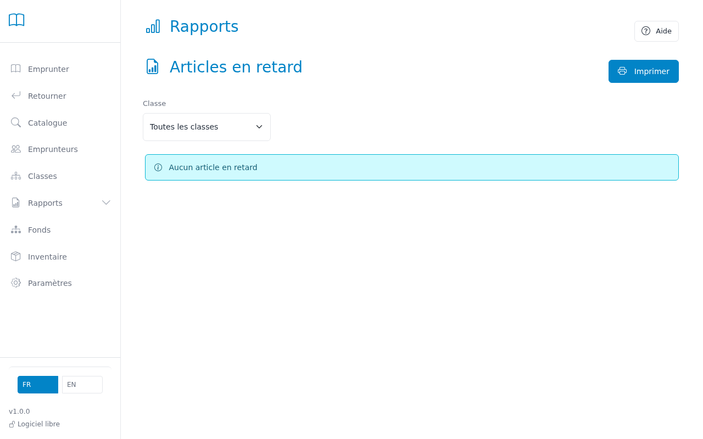
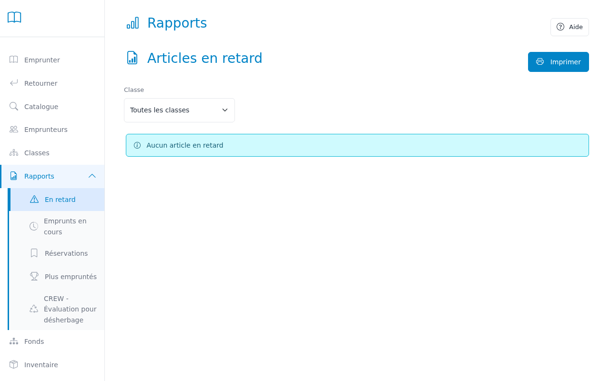
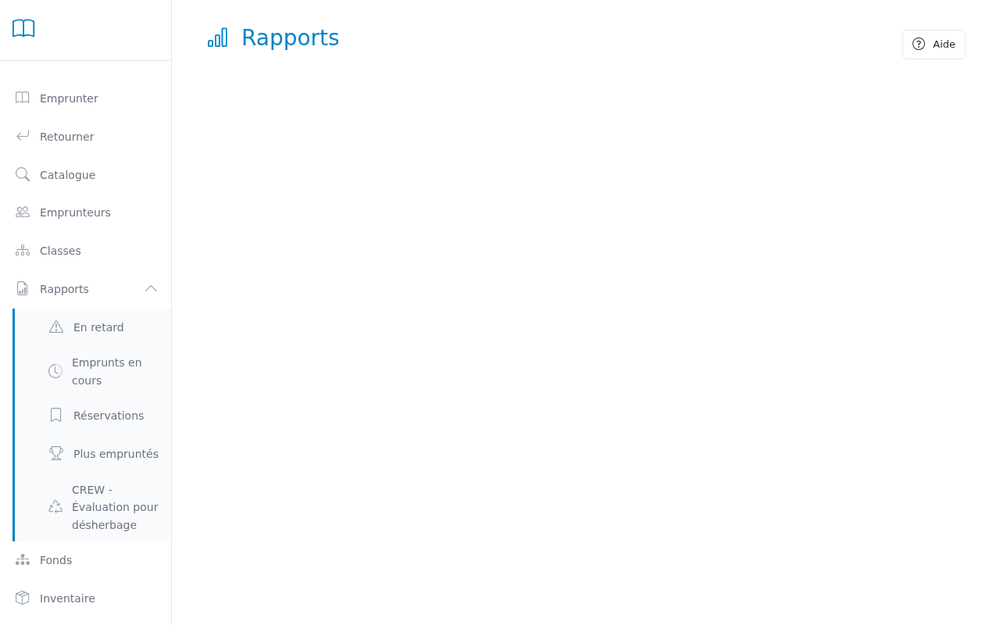
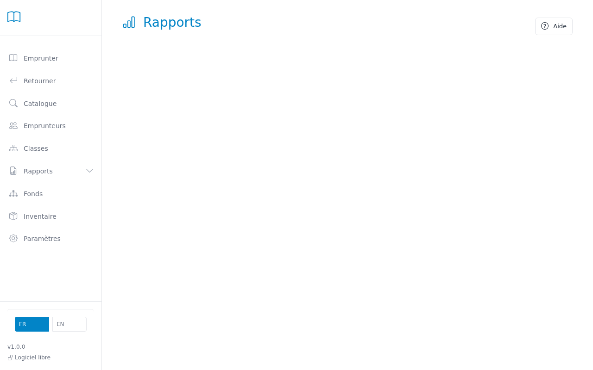
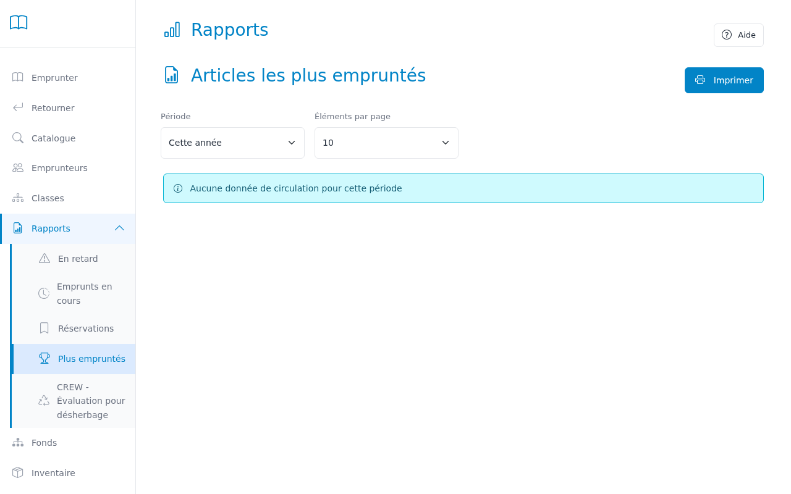

# Rapports

Cette page te permet de consulter les rapports pour suivre l'activité de la bibliothèque et gérer les retards.

---

## Étape 1 — Choisir un type de rapport

Trois rapports sont disponibles dans les onglets en haut de la page :
- **Retards** : liste des livres non rendus à temps, groupée par classe
- **Livres les plus empruntés** : classement des titres les plus populaires
- **CREW - Désherbage** : évaluation systématique pour le désherbage selon la méthode CREW
- **Réservations** : liste des réservations en cours et leur statut
- **Prêts en cours** : liste de tous les exemplaires actuellement empruntés

## Étape 2 — Rapport des retards

Le rapport des retards affiche tous les emprunts dont la date de retour est dépassée.
Les emprunts sont groupés par classe pour faciliter les relances enseignant par enseignant.

Pour chaque emprunt en retard, le rapport indique :
- Le nom et numéro de l'élève
- Le titre et numéro d'inventaire du livre
- La date d'emprunt
- La date de retour prévue
- Le nombre de jours de retard

> **Conseil :** Clique sur le nom d'un élève pour ouvrir directement sa fiche dans la page Emprunteurs.

## Étape 3 — Rapport des livres les plus empruntés

Ce rapport classe les titres par nombre d'emprunts sur une période donnée.
Il est utile pour identifier les succès et pour les décisions de réacquisition.

**Filtres disponibles :**
- **Période** : 30 derniers jours, 1 an, ou depuis toujours
- **Nombre de résultats** : limiter aux 10, 25 ou 50 premiers titres

Pour chaque titre, le rapport indique :
- Le rang (médaille or/argent/bronze pour le podium)
- Le titre et l'auteur (cliquable vers la fiche catalogue)
- Le nombre total d'emprunts, avec une barre visuelle proportionnelle

> **Astuce acquisitions** : Utilise ce rapport conjointement avec le rapport CREW. Le désherbage libère de la place et du budget ; les titres les plus empruntés révèlent les genres et thèmes en demande — achats ciblés dans ces catégories pour maximiser l'usage du fonds.

## Étape 4 — Rapport CREW - Désherbage

Le rapport CREW t'aide à identifier les livres à retirer du fonds de façon systématique et objective. Il attribue un **score** à chaque exemplaire en combinant plusieurs critères (âge, état, popularité).

> **Pour les enseignants** : Ce rapport facilite le tri annuel de la bibliothèque en identifiant les livres abîmés, jamais empruntés ou en trop grand nombre. L'objectif : libérer de l'espace pour de nouveaux livres qui plairont davantage aux élèves.

### Méthodes d'évaluation

Choisis une méthode selon ton objectif :

**1. Jamais emprunté**
- Livres jamais empruntés depuis leur achat
- **Utilité** : repérer les livres qui n'intéressent pas les élèves (thème inadapté, couverture peu attractive, mal rangés)
- Filtre par ancienneté : 6 mois, 1 an, 2 ans, 3 ans

**2. Faible rotation**
- Livres empruntés 2 fois ou moins sur les 2 dernières années
- **Utilité** : identifier les livres qui ne circulent plus et libérer de l'espace
- Pratique avant de faire de nouveaux achats

**3. Abîmés + anciens**
- Livres en mauvais état ET présents depuis 3 ans ou plus
- **Utilité** : priorité absolue pour le désherbage (état + ancienneté)
- Remplacer par des exemplaires neufs des mêmes titres si populaires

**4. Score élevé (≥5)**
- Vue d'ensemble de TOUS les candidats prioritaires au retrait
- **Utilité** : démarrer rapidement le tri sans choisir de critère précis
- Combine automatiquement : âge, état physique et popularité

**5. Jamais inventorié**
- Livres jamais vérifiés physiquement lors des inventaires annuels
- **Utilité** : repérer les livres potentiellement perdus ou volés
- Minimum 1 an d'ancienneté (les nouveautés sont exclues)

**6. Doublons peu demandés**
- Titres avec 3 exemplaires ou plus ET peu empruntés (moyenne <2 emprunts/livre sur 2 ans)
- **Utilité** : réduire les doublons des titres impopulaires
- Exemple : garder 1-2 exemplaires, retirer le reste pour gagner de la place

### Le score : comment ça marche ?

Chaque livre reçoit un **score automatique de 0 à 7+** :
- 🟢 **Score 0-2** : À garder — livre récent ou en bon état
- 🟠 **Score 3-4** : À vérifier — regarder le livre physiquement avant de décider
- 🔴 **Score 5+** : À retirer en priorité — cumule plusieurs problèmes

**Le score se calcule en additionnant :**
- **Ancienneté** : +1 à +3 points (dans le fonds depuis 1 an = +1, 2 ans = +2, 3+ ans = +3)
- **État physique** : +2 points si abîmé
- **Infos dépassées** (documentaires seulement) : +1 à +2 points si publié il y a >5 ans ou >10 ans
- **Jamais emprunté** : +2 points
- **Peu emprunté** : +1 point si seulement 1 emprunt

### Filtres avancés

Affine ta recherche avec les filtres :
- **Type de support** : Livre, CD, DVD, etc.
- **Genre** : Aventure, Fantastique, Policier, etc.
- **Niveau** : CP, CE1, CE2, CM1, CM2, etc.
- **Public cible** : Enfant, Ado, Adulte
- **Âge minimum** : Limite aux exemplaires acquis il y a plus de X mois

### Informations affichées

Pour chaque exemplaire, le rapport indique :
- **Score CREW** avec badge de couleur
- **Raisons du score** (âge, condition, circulation, etc.)
- **Code-barres** et **titre** (cliquable vers la fiche catalogue)
- **Type de support** et **condition physique**
- **Emplacement** sur l'étagère
- **Âge dans la collection** (en années et jours)
- **Année de publication**

> **Conseil pratique pour les enseignants** : Commence par la méthode "Score élevé (≥5)" pour une vue d'ensemble rapide. Vérifie toujours physiquement le livre avant de le retirer : le score est une aide, pas une décision automatique. Un livre populaire avec un score élevé peut mériter d'être gardé ou remplacé par un exemplaire neuf.

## Étape 5 — Imprimer ou exporter

Clique sur le bouton « Imprimer » pour ouvrir la vue d'impression optimisée.
Le rapport peut aussi être exporté au format CSV pour un traitement dans un tableur.

## Étape 6 — Rapport des réservations

Ce rapport liste toutes les réservations enregistrées, avec leur statut.

**Filtres disponibles :**
- **Classe** : filtrer par classe pour voir les réservations d'un groupe

Pour chaque réservation, le rapport indique :
- Le nom et la classe de l’emprunteur
- Le titre du livre réservé
- Le **statut** de la réservation (codé par couleur) :
  - 🟦 **En attente** — la réservation est dans la file d’attente
  - 🟢 **Prête** — le livre est disponible, l’emprunteur peut venir le chercher
  - 🔴 **Expirée** — la réservation n’a pas été honorée dans les délais
  - ⚪ **Annulée / Honorée** — réservation terminée
- La **position dans la file** d’attente
- La **date d’expiration**

## Étape 7 — Rapport des prêts en cours

Ce rapport liste tous les exemplaires actuellement empruntés, groupés par classe.

**Filtres disponibles :**
- **Classe** : filtrer par classe pour n’afficher qu’un groupe

Pour chaque prêt, le rapport indique :
- Le nom de l’emprunteur
- Le titre du livre
- La **date d’emprunt**
- La **date de retour prévue**
- Le **nombre de jours restants** (badge vert si ≥4 jours, orange si ≤3 jours, rouge si en retard)

> **Conseil :** Ce rapport est utile pour anticiper les retours — filtre par classe pour prévenir un enseignant que certains livres de sa classe reviennent bientôt.

---

## Problèmes fréquents

| Problème | Solution |
|----------|----------|
| Le rapport des retards est vide | Aucun emprunt n'est actuellement en retard — c'est une bonne nouvelle ! |
| Un livre apparaît encore en retard alors qu'il a été rendu | Vérifie dans la fiche du livre que le retour a bien été enregistré. |
| Le rapport CREW affiche trop de résultats | Augmente l'âge minimum (ex: 2 ans au lieu de 6 mois) ou filtre par catégorie. Commence avec les scores ≥5. |
| Un bon livre a un score CREW élevé | Le score est indicatif. Si un livre est populaire ou pertinent, conserve-le même avec un score élevé. |
| Comment désherber physiquement ? | Note les codes-barres, retire les livres des étagères, tamponne-les "retiré", et retire-les du système via l'inventaire. |
